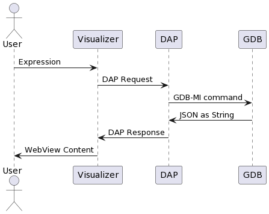

# debug-viz-demo
> Debug Visualization Demo for Ada

# Why
* It looks amazing!
* An intresting architecture
* Ideas for GNAT Studio

## You need
* VSCode
* [Debug Visualization](https://marketplace.visualstudio.com/items?itemName=hediet.debug-visualizer) extension
* [Native Debug](https://marketplace.visualstudio.com/items?itemName=webfreak.debug) extension

## Sequence diagram:

While the extension is a language agnostic
JSON is parsed from C/C++/JS string literal, but Ada literal has a distinct syntax for escape quotes and non-ASCII characters. So we need hacks right now.

To overcome, let's change language:

    --language minimal $vizText(Text)

Glue code could be
* in Python (using GDB Python API)
* in Ada (with External_Name to work with minimal lang)

### Python

    source src/aaa.py
    set print elements unlimited

    --language minimal $vizPlot(List)

### Ada

TBD
